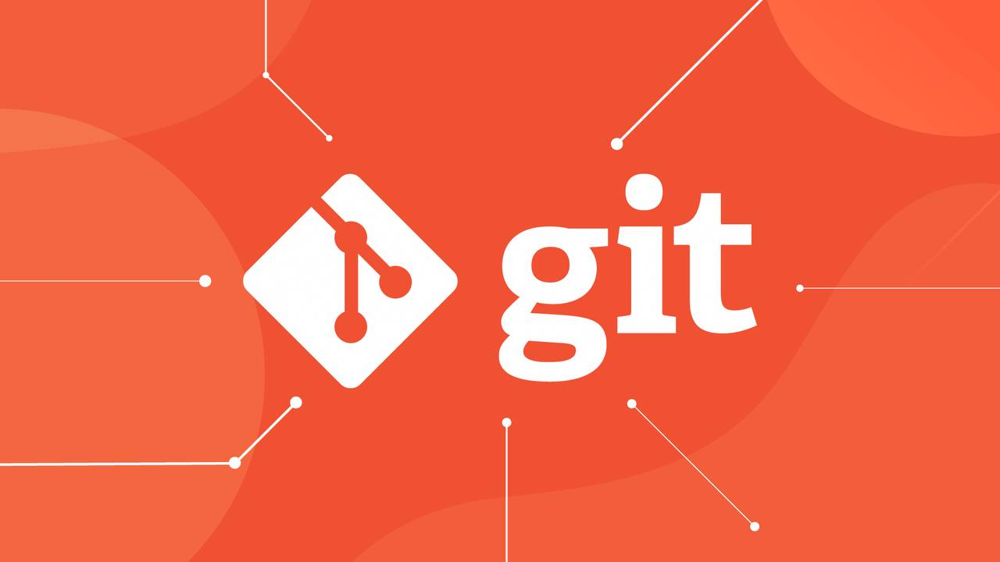

## Контроль версий с помощью Git: основа эффективной разработки

В мире разработки программного обеспечения контроль версий — это один из ключевых процессов, который помогает управлять изменениями в коде, работать в команде и поддерживать проект в актуальном состоянии. Git — это один из самых популярных инструментов для контроля версий, и его использование стало стандартом в индустрии.

### Зачем нужен контроль версий?

Контроль версий позволяет отслеживать каждое изменение в проекте, будь то добавление нового функционала, исправление ошибки или просто небольшой рефакторинг кода. С помощью Git можно вернуться к любой предыдущей версии проекта, сравнивать изменения, откатываться назад в случае ошибок, а также работать над несколькими версиями проекта параллельно.

### Основные функции Git

Git предоставляет широкий набор функций, среди которых:
- Создание и работа с ветками. Ветки (branches) позволяют изолировать работу над отдельными задачами, что особенно полезно в командной разработке.
- Слияние изменений. После завершения работы в ветке можно легко объединить её с основной (master или main), не теряя при этом никаких данных.
- Просмотр истории изменений. Git хранит подробную историю каждого коммита, что позволяет отслеживать, кто, когда и какие изменения вносил в код.
- Работа в команде. Git позволяет нескольким разработчикам работать над одним проектом, синхронизируя изменения и решая конфликты кода.

### Почему Git так популярен?

Git завоевал популярность благодаря своей гибкости, скорости и возможности работать как локально, так и с удаленными репозиториями. Он также поддерживается множеством хостинговых сервисов, таких как GitHub, GitLab и Bitbucket, которые предлагают дополнительные возможности для командной работы, автоматизации и интеграции с другими инструментами.

### Подведение итогов

Освоение Git — это обязательный навык для любого разработчика. Этот инструмент не только упрощает управление проектом, но и позволяет организовать эффективную командную работу, минимизируя риски потери данных и упрощая процесс разработки. Начать использовать Git можно уже сегодня, и чем раньше это произойдет, тем быстрее вы сможете ощутить все его преимущества.

