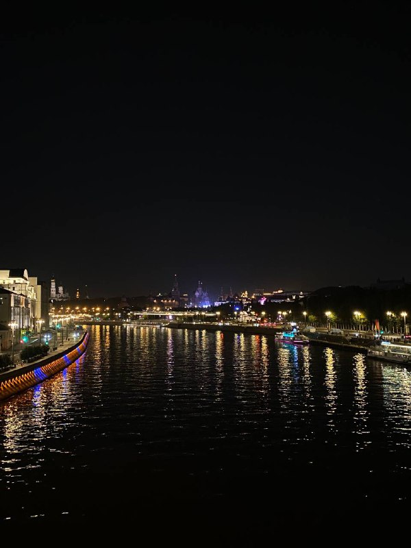

## Last days of vacation

Last week, I enjoyed the last days of vacation before the new school year begins. Despite the approaching school semester, I decided to dedicate this time to not only relaxing, but also preparing for my upcoming classes.

## New Technologies

I spent most of the week on the computer learning about new technologies. I decided to refresh my knowledge of `Python` and experimented with a couple of small projects. Also started learning the basics of `Flask` - I want to try to create a small web application in the new semester.

## Vacation with friends

But, of course, I didn't forget about a full vacation. I met up with some friends and we spent a couple of days in nature, enjoying the last warm days. 

## Ready for the new school year

Now, rested and full of energy, I am ready for the new school year. Although I am a little sad that the vacation is over, I am optimistic about the future - there is so much new knowledge and interesting tasks ahead!

